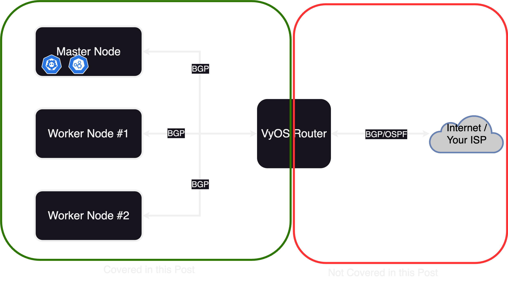
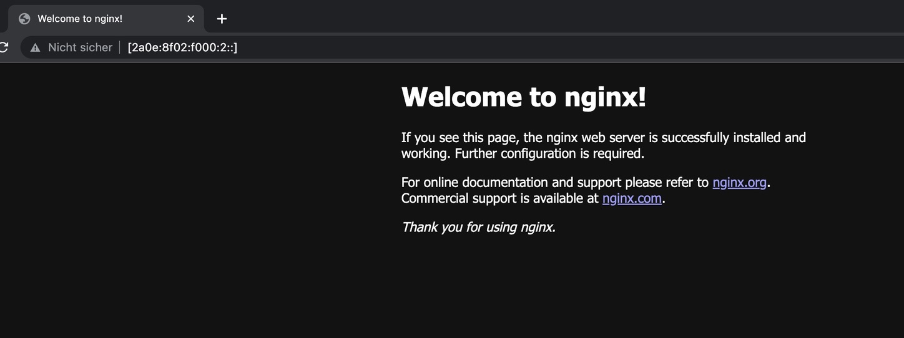

Title: Building a multi-node IPv6-enabled bare-metal kubernetes cluster with microk8s, metallb, longhorn and VyOS
Date: 2023-06-28 12:35
Category: Guides


*Some knowledge of how kubernetes works, as well as some networking basics might be helpful in understanding this post.*
## Motivation
Through some changes in my job, i first came into contact with kubernetes ~1 year ago. In this time i learned a lot, however my learning process was always somehow limited by me only having access to clusters from my company, which, of course, werent very tolerant to "some noob just fooling around".

I always wanted to operate a cluster myself to really understand whats going on under the hood. The usual cloud providers are very happy to provide you with one, for the small price of ~50$ for one controlplane node and no worker nodes. Obviously this is a bit too expensive to justify for a little hobby project. 

This was the moment i decided to try building a bare-metal cluster, as, in theory, this would be a lot cheaper as you can just use off-the-shelf hosted servers, which are a lot cheaper per compute power in comparison. One small issue though: Due to the way kubernetes provisions workloads, you wont be able to just pull up a cluster and expect everything to work right away.

Some examples for things which arent as easy as they seem:

**Networking**

Kubernetes assigns pods and containers IP addresses like you would expect, however the old idea of "one computer gets one ip address and thats it" is far from the reality in kubernetes. Most of the time, Network Ingress is controlled via, you guessed it, the [Ingress](https://kubernetes.io/docs/concepts/services-networking/ingress/) resource. Combined with LoadBalancers, kubernetes provides a robust way of how the outside can interact with your services. Heavily simplified it works roughly like this:

1. A Deployment requests that it wants to receive outside traffic
2. The cluster provisions a LoadBalancer, and an IP with it and directs traffic it receives there to the services

In cloud environments like AWS and Google Cloud (EKS and GKE), the cluster actually provisions a resource in the cloud (Often also called a loadbalancer), which you will be billed for. This means, the outside will never directly communicate with your clusters network interfaces, but rather via this little detour.

Now, for bare-metal deployments, someone, or rather, something has to be the entity providing these loadbalancers, as this is not included in any core kubernetes components. Some time ago, [MetalLB](https://metallb.universe.tf/) was created for this. MetalLB functions as the provider for LoadBalancers and basically passes out IP Adresses from different Pools and announces them either via BGP or L2 (ARP in the case of v4).

**Storage**

For Storage, the story is roughly the same. Kubernetes has, by design, a different approach to storage, as most applications are meant to be stateless and therefore dont need any persistent Storage. This is of course different for things like databases and so on, most of the time is generally a bad idea to deploy those in kubernetes though. There will however be occasions in which you need persistent storage which survives after a container is killed or deleted. For this, kubernetes has [PersistentVolumes]().

In most cloud environments, the cloud provider will provision such volumes in the cloud environment itself. As we have none of that in bare-metal deployments, we need something else: [Longhorn]() is a tool which provides persistent volume functionality by storing data on the nodes themselves. We will use longhorn to provide storage for our bare-metal cluster.

### Basic ideas and concepts of the Deployment



The cluster will consist of 3 nodes (this number is abritrary, you can either use just one node, or any other number, for better high availibility performance, this number should however be odd). Each of these nodes is a virtual machine on one hypervisor (in my case proxmox, this shouldnt matter though). Additionaly we need a router speaking BGP, to which we can later announce adresses of our cluster. In theory this router doesnt have to be controlled by you (e.g. talking directly to your ISP), but the bgp advertisements will get as small as /32 for v4 and /128 for v6, which any reasonable ISP would reject. Additionally we will establish a BGP peering between each node and the router, another fact which most ISPs will (rightfuly so) reject. This is why i chose to deploy a VyOS router along with the nodes, to which they can talk via BGP. This router will then "reannounce" the received routes via OSPF to my ISP (which in my case is me).

##### TL;DR Prerequisites
* Some Machines (or VMs) acting as nodes, running ubuntu
* BGP-enabled router _or_ an additional VM to deploy a software router like VyOS
* An IP prefix you own or you are allowed to announce (i will only use v6 here)
* An upstream router to which you can announce your prefix, which preferably has some sort of transit peering, so your prefix actually gets announced to the internet

## Setting up the actual cluster
Now to the more interesting part of this post: Actually Setting the cluster up.

### Setting up the nodes
Setting up the nodes is pretty straight forward *for now*. Just install microk8s via snap. Execute these commands on *all* of your nodes:
```bash
sudo snap install microk8s --classic
```
Then just wait until microk8s is ready:
```bash
microk8s status --wait-ready
```
Now, decide on one of the nodes to be the master node, which will host the control plane. As microk8s doesnt support IPv6 out of the box, we will have to adjust some things on this node, which will later get propagated to the other nodes.

#### Enabling IPv6 on the cluster-internal ip spaces
You only need to execute these commands on your master node.
```bash
sudo patch /var/snap/microk8s/current/args/kube-proxy << EOF
2c2,3
< --cluster-cidr=10.1.0.0/16
---
> --cluster-cidr=10.1.0.0/16,fd01::/64
> 
EOF
```
```bash
sudo patch /var/snap/microk8s/current/args/kube-apiserver << EOF
2c2
< --service-cluster-ip-range=10.152.183.0/24
---
> --service-cluster-ip-range=10.152.183.0/24,fd98::/108
>
EOF
```
```bash
sudo patch /var/snap/microk8s/current/args/kube-controller-manager << EOF
7a8,11
> --service-cluster-ip-range=10.152.183.0/24,fd98::/108
> --cluster-cidr=10.1.0.0/16,fd01::/64
> 
EOF
```
#### Enabling IPv6 for calico
microk8s uses calico as its CNI, so we have to adjust the calico configuration so that it actually assigns v6 addresses to our pods and services. This involves both the calico 'master' service, as well as the calico node service.
```bash
cat << EOF > calico-config.patch
data:
  cni_network_config: |-
    {
      "name": "k8s-pod-network",
      "cniVersion": "0.3.1",
      "plugins": [
        {
          "type": "calico",
          "log_level": "info",
          "datastore_type": "kubernetes",
          "nodename_file_optional": true,
          "nodename": "__KUBERNETES_NODE_NAME__",
          "mtu": __CNI_MTU__,
          "ipam": {
              "type": "calico-ipam",
              "assign_ipv4": "true",
              "assign_ipv6": "true"
          },
          "policy": {
              "type": "k8s"
          },
          "kubernetes": {
              "kubeconfig": "__KUBECONFIG_FILEPATH__"
          }
        },
        {
          "type": "portmap",
          "snat": true,
          "capabilities": {"portMappings": true}
        },
        {
          "type": "bandwidth",
          "capabilities": {"bandwidth": true}
        }
      ]
    }
  typha_service_name: none
  veth_mtu: "1440"
EOF
kubectl patch -n kube-system configmaps/calico-config --patch-file=calico-config.patch
```
```bash
cat << EOF > calico-node.patch
spec:
  template:
    spec:
      containers:
      - env:
        - name: IP6
          value: autodetect
        - name: IP6_AUTODETECTION_METHOD
          value: can-reach=www.google.com
        - name: CALICO_IPV6POOL_CIDR
          value: fd01::/64
        - name: FELIX_IPV6SUPPORT
          value: "true"
        name: calico-node
EOF
kubectl patch -n kube-system daemonset/calico-node --patch-file=calico-node.patch
```
#### Installing calicoctl
To add our configured v6 address pool to calico, we have to install `calicoctl` in our cluster. The version of `calicoctl` *has* to match the version of calico installed in your cluster. At the time of writing this post, the version shipped with microk8s is `3.25.0`. In case yours differs, just adjust the url accordingly:
```bash
kubectl apply -f https://raw.githubusercontent.com/projectcalico/calico/v3.25.0/manifests/calicoctl.yaml
```

#### Adding the IP pool to calico
Now we can tell calico which IPs to hand out to resources in our cluster:
```bash
kubectl exec -i -n kube-system calicoctl -- /calicoctl replace -f - << EOF
apiVersion: projectcalico.org/v3
kind: IPPool
metadata:
  name: default-ipv6-ippool
spec:
  blockSize: 122
  cidr: fd01::/64
  ipipMode: Never
  nodeSelector: all()
  vxlanMode: Never
  natOutgoing: true
EOF
```
And thats it, the networking part is done! Now we just have to restart microk8s:
```bash
microk8s stop
microk8s start
```
#### Joining the nodes into a cluster
Now we can finally join the nodes together to form a cluster. To do this, we have to create a token from our master node:
```bash
microk8s add-node
```
This will produce the following output:
```
From the node you wish to join to this cluster, run the following:
microk8s join 192.168.1.230:25000/92b2db237428470dc4fcfc4ebbd9dc81/2c0cb3284b05

Use the '--worker' flag to join a node as a worker not running the control plane, eg:
microk8s join 192.168.1.230:25000/92b2db237428470dc4fcfc4ebbd9dc81/2c0cb3284b05 --worker

If the node you are adding is not reachable through the default interface you can use one of the following:
microk8s join 192.168.1.230:25000/92b2db237428470dc4fcfc4ebbd9dc81/2c0cb3284b05
microk8s join 10.23.209.1:25000/92b2db237428470dc4fcfc4ebbd9dc81/2c0cb3284b05
microk8s join 172.17.0.1:25000/92b2db237428470dc4fcfc4ebbd9dc81/2c0cb3284b05
```
Just execute one of the commands on your worker node, to join it into the cluster. Note that you have to execute the `add-node` command once for every node you want to join.

⚠️ Pitfall: If your master node cant resolve the worker nodes hostnames to their respective IPs (e.g. because you dont have a dns server in your network), the joining wont work properly. To combat this, you can either add a dns server in your network, or just add the nodes as a static entry in `/etc/hosts` on the master node.
#### Adding the DNS server component to microk8s
The final step to setting up our nodes is adding the dns server component to microk8s:
```bash
microk8s enable dashboard dns
```
Once again, this command only has to be executed on the master node. The worker nodes will inherit all config changes.

### Installing MetalLB
As you can see from `microk8s status`, microk8s already includes metallb as an addon. However we wont be able to use this, as the default MetalLB configuration will use its own BGP daemon, which doesnt support IPv6. Hence we need to use the `frr`-mode, which, as the name suggests, uses frr as its bgp daemon. Until the core addons version supports this by itself, we have to modify it. To make things easier, i created a repo which you can just add as a dependency [here](https://github.com/mowoe/microk8s-metallb-frr-addon).
Add the repo:
```bash
microk8s addons repo add mowoe-metallb-frr https://github.com/mowoe/microk8s-metallb-frr-addon
microk8s addons repo update mowoe-metallb-frr
```
After that we can just enable it:
```bash
microk8s enable mowoe-metallb-frr/metallb-frr
```
You will be prompted for an IP prefix, which will be the default Addresspool for Metallb. Just input any random prefix, we wont be using it. Now Metallb should be successfully installed. Until we can use this though, we first have to set up our router correctly.

⚠️ There is currently a bug in metallb which sometimes messes up the cert configuration for the webhooks metallb provides so that kubernetes can validate the custom resources. The issue is documented [here](https://github.com/metallb/metallb/issues/1597). If this applies to you, i would recommend setting `failurePolicy=Ignore` like it is suggested there in your metallb deployment. This requires modifying the microk8s addon.

## Setting up our VyOS router
(Skip this part if you already have a BGP enabled router in your network and know how to configure it)

As every configuration is different, i will only go into detail on how to setup the peerings to the kubernetes nodes. At the end of this post, all prefixes announced from kubernetes will be in the routing table of this VyOS router, but you still have to redistribute them to your ISP.

At this point, you should have a vyos router up and running which is in the same network as your nodes.

To establish peering sessions to our nodes, we first have to configure the system-ASN. If you have an ASN, configure it accordingly, otherwise use a random ASN fromt the [Private ASN range (RFC6996)](https://datatracker.ietf.org/doc/html/rfc6996).
```bash
set protocols bgp system-as 'your-asn'
set protocols bgp parameters router-id '10.0.0.1'
```
Then we can add a peering for each node (adjust the ip accordingly for each node):
```bash
set protocols bgp neighbor 10.0.0.2 address-family ipv6-unicast
set protocols bgp neighbor 10.0.0.2 description 'metallb-node-01'
set protocols bgp neighbor 10.0.0.2 remote-as '213127'
```
As expected, the sessions wont come up just yet, as we dont have the peerings configured on the nodes themselves.

## Configuring MetalLB
To configure MetalLB, we essentially need three things:

1. An Adresspool
2. A BGPPeer
3. An announcement

#### The Adress Space
First we need to configure an adresspool from which MetalLB will hand out adresses. We do this by defining a resource for the CRD `IPAddressPool`:

`pool.yaml`
```yaml
apiVersion: metallb.io/v1beta1
kind: IPAddressPool
metadata:
  name: default-pool
  namespace: metallb-system
spec:
  addresses:
  - your:prefix::/64
```
I have used an adress space from my prefix, you will obviously have to adjust the prefix accordingly.

Save the file under a name of your choice and apply it with
```bash
kubectl apply -f pool.yaml
```
#### The BGPPeer
For the Peering with our VyOS router, we also define a custom resource:

`peer.yaml`
```yaml
apiVersion: metallb.io/v1beta2
kind: BGPPeer
metadata:
  name: vyos-gw
  namespace: metallb-system
spec:
  myASN: your-asn
  peerASN: your-asn
  peerAddress: 10.0.0.1
```
Once again, adjust the ASN and the address of your router and apply it with
```bash
kubectl apply -f peer.yaml
```
#### The advertisement
Metallb wont announce any prefixes until you have defined a `BGPAdvertisement` resource. We dont need to actually configure anything in it, so you can leave it as is.

`advertisement.yaml`
```yaml
apiVersion: metallb.io/v1beta1
kind: BGPAdvertisement
metadata:
  name: default-advertisement
  namespace: metallb-system
```
And one last time, apply this with 
```bash
kubectl apply -f advertisement.yaml
```
Now MetalLB should be configured correctly and ready to go.

## Deploying our first resource
To test our new cluster, we can deploy a very simple `nginx` application:

`nginx.yaml`
```yaml
kind: Service
apiVersion: v1
metadata:
  name: nginx
  labels:
    app: nginx
  annotations:
    metallb.universe.tf/address-pool: default-pool
spec:
  ipFamilyPolicy: SingleStack
  ipFamilies: 
  - IPv6
  selector:
    app: nginx
  ports:
  - port: 80
    protocol: TCP
    targetPort: 80
  type: LoadBalancer
---
apiVersion: apps/v1
kind: Deployment
metadata:
  name: nginx
  labels:
    app: nginx
spec:
  replicas: 1
  selector:
    matchLabels:
      app: nginx
  template:
    metadata:
      labels:
        app: nginx
    spec:
      containers:
      - name: nginx
        image: nginx:latest
        imagePullPolicy: Always
        ports:
        - containerPort: 80
          protocol: TCP
```

Take a look at

* `annotations.metallb.universe.tf/adress-pool: default-pool` Here we tell metallb from which pool it should choose an address for this service. The pool is the one we configured earlier
* `spec.ipFamilyPolicy: SingleStack` we strictly want IPv6-only

Deploy the application with
```bash
kubectl apply -f nginx.yaml
```

Now we can check if our service got an address:
```bash
kubectl get svc/nginx -n default

NAME    TYPE           CLUSTER-IP   EXTERNAL-IP          PORT(S)        AGE
nginx   LoadBalancer   fd98::1163   2a0e:8f02:f000:2::   80:30544/TCP   25s
```
If your BGP configuration is setup probably, the address under `EXTERNAL-IP `should be publicly reachable. Lets check:


Yay \o/ seems like its working.

## Continuing from here
We now have a working kubernetes cluster in which we can deploy our workloads. One part is however still missing: Storage. For this i would recommend to install longhorn, which provides everythin necessary for your kubernetes cluster storage-wise. I will probably make another post covering this.
### Troubleshooting
If your service isnt reachable, try to narrow down the source:
#### Is the address getting announced to your router?
First, check if the anuoncement is actually made from the metallb-`speaker` components. In the case of VyOS, you can check the received announcements with
```
show bgp summary
```
The number of prefixes received should match your expectation.
#### Is the internal frr daemon anouncing the prefixes?
Sometimes it might be worth to check if metallb actually generated the frr configuration correctly. To do this, first check the name of the speaker pods:
```bash
kubectl get all -n metallb-system
NAME                              READY   STATUS 
pod/speaker-lrp92                 4/4     Running
pod/controller-7bfbddb7f6-vtrrb   1/1     Running
pod/speaker-d2g4m                 4/4     Running
```
Then, choose one of the speaker pods, and get a shell into the `frr` container:
```bash
kubectl exec --stdin --tty -n metallb-system -c frr speaker-d2g4m -- /bin/sh
```
Now, you can directly interact with frr by using the [`vtysh`](https://docs.frrouting.org/projects/dev-guide/en/latest/vtysh.html) command. Refer to the documentation for more information about it.
#### Further things to check
* Did the assignment work (can you see an `EXTERNAL-IP` for the service)?
    * If not, check the logs of the metallb `controller` component for errors
* Can you reach the service via ther `INTERNAL-IP`
    * If not, the issue is probably not with metallb, but rather with the CNI or the service itself
* Did the pods associated with the service receive an IPv6 address? (check with `kubectl describe pod/foo`)
    * If not, the CNI is probably improperly configured
#### 

### Thanks
Many thanks to the [reudnetz w.V.](https://reudnetz.org) for providing me with the infrastructure for this project.